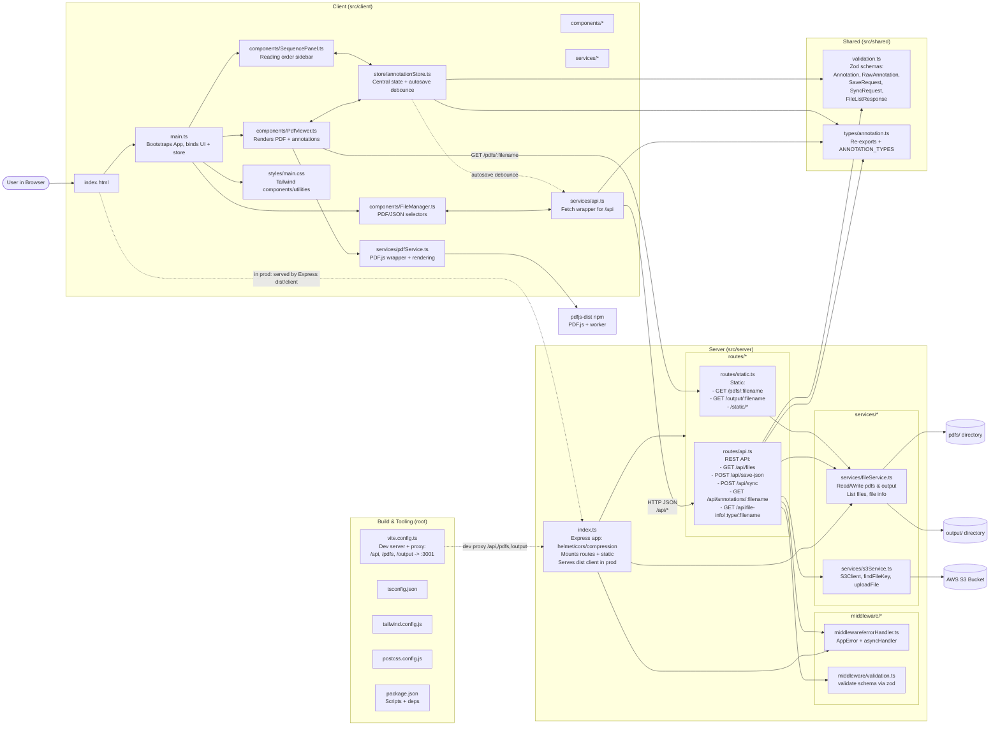

# Document Layout Annotation Editor

A modern, feature-rich PDF annotation editor built with TypeScript, Express, and Vite. This application allows users to view PDF documents and create/edit annotations with a clean, responsive interface.

Intended for use in creating datasets for fine-tuning the [Huridocs PDF Document Layout Analysis](https://github.com/huridocs/pdf-document-layout-analysis) model.

## Features

- **Modern Architecture**: Built with TypeScript for type safety and better developer experience
- **Responsive Design**: Clean, modern UI with Tailwind CSS
- **Real-time Updates**: Live preview of annotations as you create them
- **Drag & Drop**: Intuitive annotation creation and manipulation
- **Auto-save**: Automatic saving with debouncing
- **File Management**: Easy selection of PDF and JSON files
- **Keyboard Shortcuts**: Navigate pages and save with keyboard shortcuts
- **Error Handling**: Comprehensive error handling with user-friendly messages

## Architecture

The application follows a modern, modular architecture:



## File Structure

```
src/
├── server/          # Express server with TypeScript
├── client/          # Frontend application
│   ├── components/  # Reusable UI components
│   ├── services/    # API and PDF services
│   ├── store/       # State management
│   └── styles/      # CSS and styling
└── shared/          # Shared types and utilities
```

## JSON Schema

The Huridocs PDF Document Layout Analysis model returns JSON data with the following schema:

```json
{
  "type": "array",
  "items": {
    "type": "object",
    "properties": {
      "left": {
        "type": "number",
        "description": "The horizontal position of the element's left edge in points from the page's left edge"
      },
      "top": {
        "type": "number",
        "description": "The vertical position of the element's top edge in points from the page's top edge"
      },
      "width": {
        "type": "number",
        "description": "The width of the element in points"
      },
      "height": {
        "type": "number",
        "description": "The height of the element in points"
      },
      "page_number": {
        "type": "integer",
        "description": "The 1-based page number where this element appears"
      },
      "page_width": {
        "type": "integer",
        "description": "The total width of the page in points"
      },
      "page_height": {
        "type": "integer",
        "description": "The total height of the page in points"
      },
      "text": {
        "type": "string",
        "description": "The textual content extracted from this document element"
      },
      "type": {
        "type": "string",
        "enum": [
          "Caption",
          "Footnote", 
          "Formula",
          "List item",
          "Page footer",
          "Page header",
          "Picture",
          "Section header",
          "Table",
          "Text",
          "Title"
        ],
        "description": "The classification type of this element"
      }
    },
    "required": [
      "left", "top", "width", "height",
      "page_number", "page_width", "page_height",
      "text", "type"
    ]
  }
}
```

The annotation tool mostly preserves this schema, but it adds unique `id` fields to each annotation. You will want to remove the ids before running any fine-tuning workflow.

## Getting Started

### Prerequisites

- Node.js 18+ 
- bun

### Installation

1. Clone the repository
2. Install dependencies:
   ```bash
   bun install
   ```

3. Create the required directories:
   ```bash
   mkdir pdfs output
   ```

4. Start the development server:
   ```bash
   bun run dev
   ```

This will start:
- Backend server on http://localhost:3001
- Frontend dev server on http://localhost:3000

### Usage

1. **Add PDFs**: Place PDF files in the `pdfs/` directory
2. **Create JSON**: The app will create JSON files in the `output/` directory
3. **Annotate**: Select a PDF and JSON file, then click and drag to create annotations
4. **Save**: Changes are auto-saved, or use the Save button

### Development

- **Type Check**: `bun run type-check` - Type check the project
- **Dogfooding**: `bun run dev` - Runs Vite dev server and TS watch with hot reload
- **Build**: `bun run build` - Builds for production
- **Preview**: `bun run preview` - Preview production build

### API Endpoints

- `GET /api/files` - List available PDF and JSON files
- `POST /api/save-json` - Save annotations to JSON file
- `GET /pdfs/:filename` - Serve PDF files
- `GET /output/:filename` - Serve JSON files

## Technology Stack

- **Backend**: Express.js with TypeScript
- **Frontend**: TypeScript with Vite
- **Styling**: Tailwind CSS
- **UI Interactivity**: Interact.js
- **Type Validation**: Zod
- **PDF Rendering**: PDF.js
- **Build Tools**: Vite, TypeScript, ESLint, Prettier

## Contributing

1. Fork the repository
2. Create a feature branch
3. Make your changes
4. Run tests and linting
5. Submit a pull request

## License

MIT License - see LICENSE file for details
